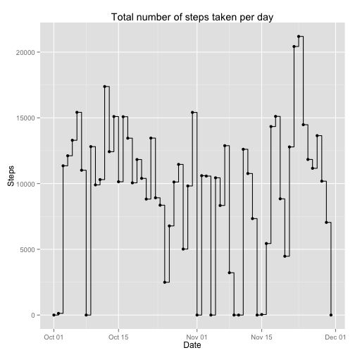
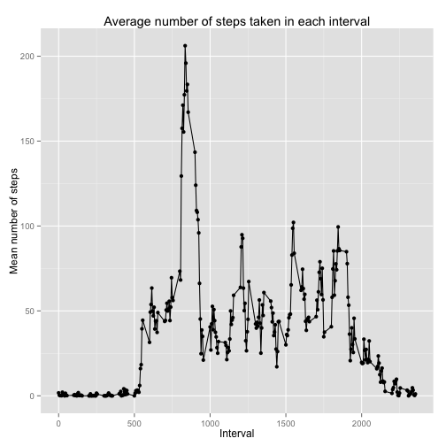
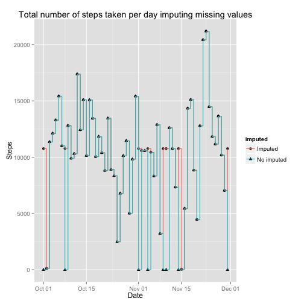
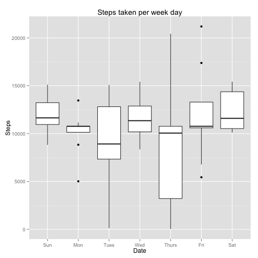
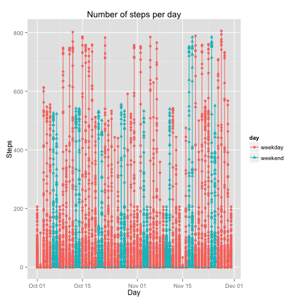
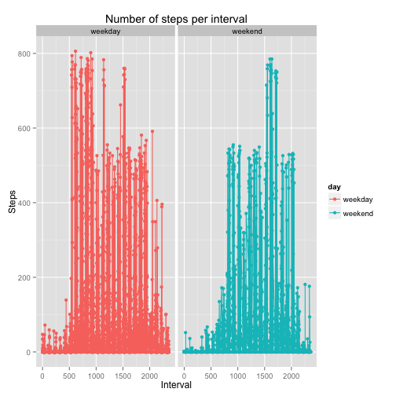
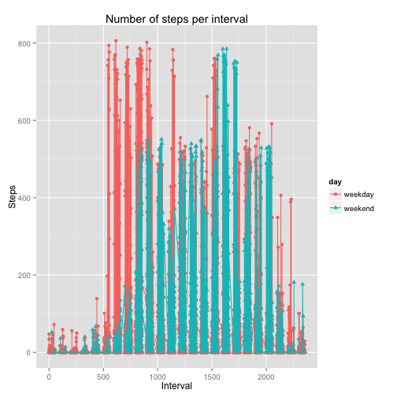

# Reproducible Research: Peer Assessment 1
This document was built following the instructions in: `doc/instructions.pdf`. That file contains all the specifications.


## Loading and preprocessing the data

```r
# Throughout this work, the following libraries are required
library(ggplot2)
library(plyr)
library(xtable)

# Create the directory if necessary
workdirPath <- "./data"
if(!file.exists(workdirPath))
{
  dir.create(workdirPath)
}

# Unzip the files if necessary
dataFile <- paste(workdirPath,"activity.csv", sep="/")
if(!file.exists(dataFile))
{
  dataFileZip <- paste("activity.zip")
  unzip(zipfile=dataFileZip, exdir=workdirPath) 
}

# Load the data 
data <- read.csv(dataFile)

# Pre-process the data
data$date <- as.Date(data$date, "%Y-%m-%d")
```

Note that the compressed data was originally in the currenct directory, and by means of the code above, it was unziped in a new folder, namely, in `./data`.


## What is mean total number of steps taken per day?

```r
# Calculate the total number of steps taken per day
dataByDate <- ddply(data, .(date), summarise,
                    TotalSteps  = sum(steps, na.rm = TRUE), 
                    MeanSteps   = mean(steps, na.rm = TRUE), 
                    StDevSteps  = sd(steps, na.rm = TRUE), 
                    MedianSteps = median(steps, na.rm = TRUE))

# Make a histogram of the total number of steps taken each day
ggplot(dataByDate, aes(x=date, y=TotalSteps)) + geom_point() + geom_step() + 
  xlab("Date") + ylab("Steps") + ggtitle("Total number of steps taken per day") 
```

 


The plot shows the total number of steps taken each day. Next, let us show the the mean and median total number of steps taken per day.


```r
# Report the the mean and median total number of steps taken per day
head(subset(dataByDate, complete.cases(dataByDate)),n=10) # I am showing only 10
```

```
##          date TotalSteps MeanSteps StDevSteps MedianSteps
## 2  2012-10-02        126   0.43750   6.912816           0
## 3  2012-10-03      11352  39.41667 111.897882           0
## 4  2012-10-04      12116  42.06944 108.601541           0
## 5  2012-10-05      13294  46.15972 120.916458           0
## 6  2012-10-06      15420  53.54167 121.204632           0
## 7  2012-10-07      11015  38.24653  88.333457           0
## 9  2012-10-09      12811  44.48264 130.016669           0
## 10 2012-10-10       9900  34.37500  77.077894           0
## 11 2012-10-11      10304  35.77778 127.648414           0
## 12 2012-10-12      17382  60.35417 155.086262           0
```

```r
# You can tidy up the results as follows:
#xt <- xtable(subset(dataByDate, complete.cases(dataByDate)), caption="Steps")
#names(xt)<- c("Date", "Total Steps","Mean Steps", "Standard Deviation Steps", "Median Steps")
#print(xt, type="html")
```


## What is the average daily activity pattern?

```r
# Make a time series plot (i.e. type = "l") of the 5-minute interval (x-axis) and the average number of steps taken, averaged across all days (y-axis)
dataByInterval <- ddply(data, .(interval), summarise, MeanStepsWithinInterval  = mean(steps, na.rm=TRUE))
ggplot(dataByInterval, aes(x=interval, y=MeanStepsWithinInterval)) + geom_point() + geom_line() + 
  xlab("Interval") + ylab("Mean number of steps") + ggtitle("Average number of steps taken in each interval") 
```

 

```r
# Which 5-minute interval, on average across all the days in the dataset, contains the maximum number of steps?
max <- dataByInterval[which.max(dataByInterval$MeanStepsWithinInterval),]
max
```

```
##     interval MeanStepsWithinInterval
## 104      835                206.1698
```

Accordingly, on average across all the days in the dataset, the **maximum number of steps** is 206.17, and this occurs in the  **835-th interval**.


## Imputing missing values
Note that there are a number of days/intervals where there are missing values (coded as NA). The presence of missing days may introduce bias into some calculations or summaries of the data.


```r
# Calculate and report the total number of missing values in the dataset (i.e. the total number of rows with NAs)
numMissing <- sum(is.na(data$steps))
numMissing
```

```
## [1] 2304
```

There are 17568 data, nevertheless, 2304 of them are missing. That is,  13.11% of the data are missing values. In an attempt to overcome the bias introduced by the presence of missing values, we will *approach* each missing value with the mean associated to that 5-minute interval}.


### Create a new dataset that is equal to the original dataset but with the missing data filled in.

```r
# Create a new dataset that is equal to the original dataset but with the missing data filled in.
dataNoMissing <- data
for(i in 1:nrow(dataNoMissing)){
  if( is.na(dataNoMissing[i,"steps"]) ){
    intervalNum <- dataNoMissing[i,"interval"]
    dataNoMissing[i,"steps"] <- dataByInterval[dataByInterval$interval==intervalNum,"MeanStepsWithinInterval"] 
  }
}
```


### Make a histogram of the total number of steps taken each day on the imputed data set

```r
# Get the total number of steps taken each day  
dataNoMissingByDate <- ddply(dataNoMissing, .(date), summarise, 
                    TotalSteps  = sum(steps, na.rm = TRUE), 
                    MeanSteps   = mean(steps, na.rm = TRUE), 
                    StDevSteps  = sd(steps, na.rm = TRUE), 
                    MedianSteps = median(steps, na.rm = TRUE))
# Merge both sets
dataByDate$imputed <- "No imputed"
dataNoMissingByDate$imputed <- "Imputed"
dataMerged <- merge(dataByDate, dataNoMissingByDate, all=TRUE)

# Make a histogram of the total number of steps taken each day for each data set: original, imputed
ggplot(dataMerged, aes(x=date, y=dataMerged$TotalSteps, group=imputed, shape=imputed)) + geom_point(aes(shape=imputed)) + geom_step(aes(color=imputed)) + 
  xlab("Date") + ylab("Steps") + ggtitle("Total number of steps taken per day imputing missing values") 
```

 

This plot shows the difference between the original data (the one with missing values denoted as "No imputed") and the new data in which the missing values were replaced by the mean of the interval (denoted as "imputed"). The differences are self-evident since the two plots do not completely overlap.


### Calculate and report the mean and median total number of steps taken per day on the imputed data 

```r
# Calculate and report the mean and median total number of steps taken per day.
head(subset(dataNoMissingByDate, select = -imputed), n=10) # I am showing only 10
```

```
##          date TotalSteps MeanSteps StDevSteps MedianSteps
## 1  2012-10-01   10766.19  37.38260  38.664336    34.11321
## 2  2012-10-02     126.00   0.43750   6.912816     0.00000
## 3  2012-10-03   11352.00  39.41667 111.897882     0.00000
## 4  2012-10-04   12116.00  42.06944 108.601541     0.00000
## 5  2012-10-05   13294.00  46.15972 120.916458     0.00000
## 6  2012-10-06   15420.00  53.54167 121.204632     0.00000
## 7  2012-10-07   11015.00  38.24653  88.333457     0.00000
## 8  2012-10-08   10766.19  37.38260  38.664336    34.11321
## 9  2012-10-09   12811.00  44.48264 130.016669     0.00000
## 10 2012-10-10    9900.00  34.37500  77.077894     0.00000
```

```r
#xt <- xtable(dataNoMissingByDate, caption="Steps")
#print(xt, type="html")

# What is the impact of imputing missing data on the estimates of the total daily number of steps?
totalOriginal <- sum(subset(dataMerged, imputed=='No imputed',select=TotalSteps),na.rm=TRUE)
totalImputed  <- sum(subset(dataMerged, imputed=='Imputed',select=TotalSteps))
```

**Do these values differ from the estimates from the first part of the assignment? **
* The total number of steps on the original data-set: 5.70608 &times; 10<sup>5</sup> 
* The total number of steps on the imputed data-set: 6.5673751 &times; 10<sup>5</sup>
The difference between them: 7.02%.


## Are there differences in activity patterns between weekdays and weekends?

```r
library("lubridate")
```

```
## 
## Attaching package: 'lubridate'
## 
## The following object is masked from 'package:plyr':
## 
##     here
```

```r
dataNoMissingByWDay <- dataNoMissing
dataNoMissingByWDay <-   ddply(dataNoMissingByWDay, .(date), summarise, TotalSteps  = sum(steps, na.rm = TRUE))
dataNoMissingByWDay$date <- wday(dataNoMissingByWDay$date, label=TRUE)

ggplot(dataNoMissingByWDay, aes(x=date, y=TotalSteps)) + geom_boxplot() +  
  xlab("Date") + ylab("Steps") + ggtitle("Steps taken per week day") 
```

 

This box-plot shows the diferences on steps by week-day. In addition, we provide below with the full-table of results.


```r
summarydataNoMissingByWDay <- ddply(dataNoMissingByWDay, .(date), summarise,  MeanSteps=mean(TotalSteps, na.rm = TRUE), StDevSteps=sd(TotalSteps, na.rm = TRUE))
summarydataNoMissingByWDay
```

```
##    date MeanSteps StDevSteps
## 1   Sun 12088.774   2154.603
## 2   Mon 10150.709   2270.804
## 3  Tues  8949.556   4693.636
## 4   Wed 11676.910   2155.313
## 5 Thurs  8496.465   6162.292
## 6   Fri 12005.597   4879.720
## 7   Sat 12314.274   2150.670
```

```r
#xt <- xtable(summarydataNoMissingByWDay, caption="Steps")
#print(xt, type="html")
```


The specifications (turn to `doc/instructions.pdf`) suggest to make use of `weekdays()` function. Instead, I have used `wday()`, a function within `lubridate` library for the same purpose. The specifications ask to use the dataset with the filled-in missing values for this part (stored in the variable `dataNoMissing`).

1. Create a new factor variable in the dataset with two levels – “weekday” and “weekend” indicating whether a given date is a weekday or weekend day.
2. Make a panel plot containing a time series plot (i.e. type = "l") of the 5-minute interval (x-axis) and the average number of steps taken, averaged across all weekday days or weekend days (y-axis). 


```r
# Create a new factor variable in the dataset with two levels – “weekday” and “weekend”
dataNoMissingWeekend <- dataNoMissing
dataNoMissingWeekend$wday <- wday(dataNoMissingWeekend$date, label = TRUE, abbr = TRUE)
dataNoMissingWeekend$isWeekend <- ((dataNoMissingWeekend$wday == wday(1, label = TRUE, abbr = TRUE) )  | (dataNoMissingWeekend$wday == wday(7, label = TRUE, abbr = TRUE) ))
dataNoMissingWeekend$day <- "weekday"
dataNoMissingWeekend[dataNoMissingWeekend$isWeekend,"day"] <- "weekend"

# plot(dataNoMissingWeekend$date, dataNoMissingWeekend$steps,type = "l")

lp <- ggplot(data=dataNoMissingWeekend, aes(x=date, y=steps, shape=day, group=day)) + 
  geom_point(aes(colour=day)) + geom_line(aes(colour=day)) + 
  ggtitle("Number of steps per day") + xlab("Day") + ylab("Steps") 
lp # show the result
```

 

Each point on the previous graph corresponds to a different interval within a given day. This is why for a given day there are many points. Next, given a interval, we will sum the steps within all the days. 


```r
dataNoMissingWeekendSummary <- ddply(dataNoMissingWeekend, .(interval,day), summarise, 
                    TotalSteps  = sum(steps, na.rm = TRUE), 
                    MeanSteps   = mean(steps, na.rm = TRUE), 
                    StDevSteps  = sd(steps, na.rm = TRUE), 
                    MedianSteps = median(steps, na.rm = TRUE))

# Make a panel plot containing a time series plot (i.e. type = "l") of the 5-minute interval (x-axis) and the average number of steps taken, averaged across all weekday days or weekend days (y-axis). 
ggplot(dataNoMissingWeekend, aes(x=interval, y=steps)) + 
  facet_grid(. ~ day)  +   geom_point(aes(colour=day)) + geom_line(aes(colour=day)) + 
  ggtitle("Number of steps per interval") + xlab("Interval") + ylab("Steps")
```

 

There we are the weekdays and weekends separately, but we can put both of them within the same graph in order to make comparisons.


```r
ggplot(data=dataNoMissingWeekend, aes(x=interval, y=steps,shape=day,group=day)) + 
  geom_point(aes(colour=day)) + geom_line(aes(colour=day)) + 
  ggtitle("Number of steps per interval") + xlab("Interval") + ylab("Steps")
```

 


The plot should look something like the following, which was creating using simulated data:


**Your plot will look different from the one above** because you will be using the activity monitor data. Note that the above plot was made using the lattice system but you can make the same version of the plot using any plotting system you choose.

